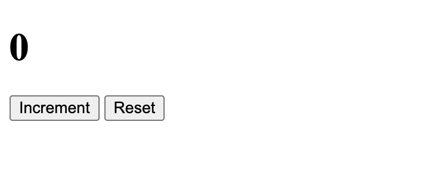

# swe-4-1-dom-events
An assignment to practice using the DOM API and Handling Events

# Assignment 4.1 - Document Object Model and Events

**Table of Contents**
- [Reminders](#reminders)
- [Setup](#setup)
- [Short Response Questions](#short-response-questions)
- [Coding Part 1: Counter From Scratch](#coding-part-1-counter-from-scratch)
- [Coding Part 2: Magic 8-Ball](#coding-part-2-magic-8-ball)
- [Coding Part 3: Marcy Music](#coding-part-3-marcy-music)

## Reminders

**<details><summary>Asking ChatGPT for Help</summary>**

If you're stuck, you may use ChatGPT to clarify the assignment — but not to solve it for you. To do this, copy the meta-prompt below into ChatGPT along with the assignment question.

> You are acting as a tutor. Your job is to explain what this coding question is asking, clarify confusing wording, and highlight the relevant concepts students need to know — but do not provide the full solution or code that directly answers the question. Instead, focus on rephrasing the problem in simpler terms, identifying what's being tested, and suggesting what steps or thought processes might help. Ask guiding questions to ensure the student is thinking critically. Do not write the final function, algorithm, or code implementation.

Be mindful of your AI usage on assignments. AI can be a great tool to help your learning but it can also be detrimental if you let it do too much of the thinking for you.

</details>

**<details><summary>Be Okay With Being "Provisionally Complete"</summary>**

At Marcy, we will deem an assignment as "complete" if you satisfy the requirements listed below. 

However, we know many of you will feel the urge to hold off on submitting until your assignment feels 100% perfect. That drive for excellence is an asset!

But perfectionism can also get in the way of learning — especially when we need to cover a lot in a short amount of time.

That's why we encourage you to be comfortable with being **"provisionally complete."** This means:

- Submitting your work even if it isn't perfect yet
- Treating submission as a checkpoint, not a finish line
- Committing to return, revise, and improve later

Learning to move forward with provisional completeness will help you make steady progress while still building the habit of continuous improvement.

</details>

## Setup

For guidance on setting up and submitting this assignment, refer to the Marcy Lab School Docs How-To guide for [Working with Short Response and Coding Assignments](https://marcylabschool.gitbook.io/marcy-lab-school-docs/how-tos/working-with-assignments#how-to-work-on-assignments).

Files to modify are found in the `src/` directory:
- `1-counter-from-scratch/`
- `2-magic-8-ball/`
- `3-marcy-music/`
- `short-response.md`

**To view your page**: Drag and drop the `index.html` from the file explorer in VS Code directly into your Chrome Browser tab (do not use Safari — their devtools are terrible. Firefox is okay but not preferred).

Here are some useful commands to remember to get started

```sh
git checkout -b draft   # switch to the draft branch before starting

git add -A              # add a changed file to the staging area
git commit -m 'message' # create a commit with the changes
git push                # push the new commit to the remote repo
```

When you are finished, create a pull request and tag your instructor for review.

## Short Response Questions

Short response questions can be found in the `src/short-response.md` file. Write your responses directly in that file. Do not forget to complete this part of the assignment.

## Coding Part 1: Counter From Scratch

In the `1-counter-from-scratch/` folder, build a Counter app from scratch.



**Requirements (6 points):**

To build this app, you will need to:

- [ ] Create an `index.html` page with the following elements:
  - [ ] An `h1` to display the current count (starting at 0)
  - [ ] A "+" button to click to increase the count
  - [ ] A "Reset" button to set the count back to 0
- [ ] Create an `index.js` file that is loaded by the `index.html` file
  - [ ] Each time the main button is clicked, increment the count and update the heading to display the current count

Note: you do not need to use semantic elements to structure the page

**Bonus Challenges (3 bonus points):**

As a bonus, turn the app into a game to see how quickly you can click the button!
- [ ] Add a 10-second timer and see how many clicks you can get before the time runs out.
- [ ] Make the reset button reset the timer and try again
- [ ] Track and display the high score in a list below the buttons

## Coding Part 2: Magic 8-Ball

In the `2-magic-8-ball/` folder, a project has been started but we need your help to make it interactive. 

First, get oriented:
* Open the `index.html` file in your browser to see the magic 8 ball.
* Study the elements in the HTML file and pay close attention to the classes and ids on the elements.
* Study the `style.css` file. **Notice that the #answer element has `display:none;` which makes it hidden by default.** 

**Requirements (5 points):**

Now, to make the page interactive you will need to do the following:

- [ ] Add an event listener to the "Ask" button that:
  - [ ] hides the eight ball (hint: adjust the `style.display` property)
  - [ ] generates a random fortune from the fortunes array
  - [ ] sets the text of the answer element to the chosen fortune
  - [ ] shows the answer element

## Coding Part 3: Marcy Music

In the `3-marcy-music/` folder, the HTML structure for a music player has been created.

First, get oriented:
* Open the `index.html` file in your browser to see the Marcy Music app
* Study the elements in the HTML file and pay close attention to the classes and ids on the elements.
* Study the `style.css` file. Look for this declaration which shows how a playlist card will look when "selected":

  ```css
  .playlist-card.selected {
    border-color: var(--color-primary);
  }
  ```

* Open the `index.js` file where you will find a `playlists` array full of data to render.


**Requirements (6 points):**

Your task is to use JavaScript and the DOM to dynamically create the playlist cards and add interactivity such that when you click on a playlist, it will be marked as "selected" and will be shown as "now playing".

- [ ] In `index.js`, for each playlist in the given `playlists` array, create a list item with the playlist title and image:
    ```html
    <li class="playlist-card" data-title="Chill Vibes">
      
      <p>Chill Vibes</p>
    </li>
    ```
- [ ] Add a click event listener to the playlist cards that:
  - [ ] Adds the `"selected"` class on the clicked playlist card
  - [ ] Sets the `#now-playing-title` span text content to be the title of playlist that was last clicked
  - [ ] Removes the `"selected"` class from the previously selected card.
- [ ] Use event delegation to handle all click events rather than adding an event listener to every single card.
